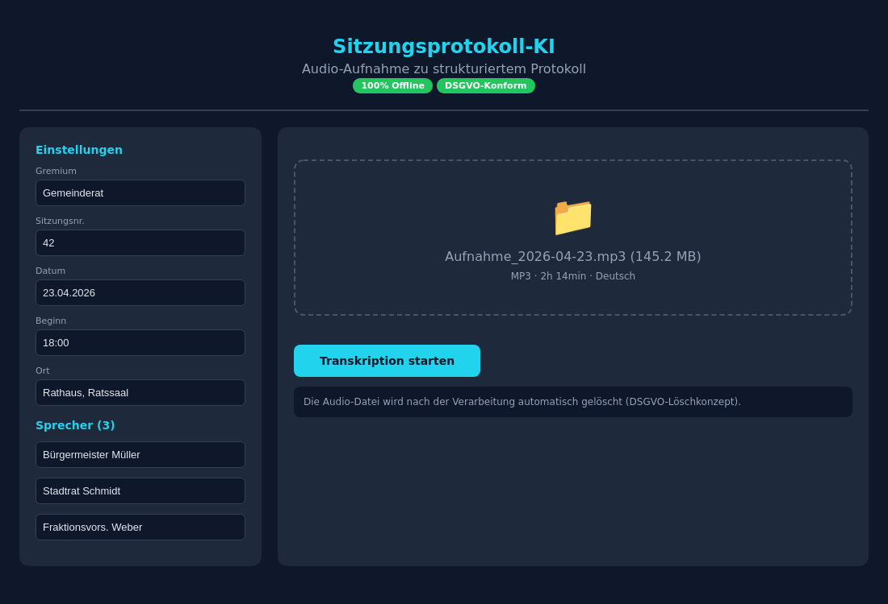
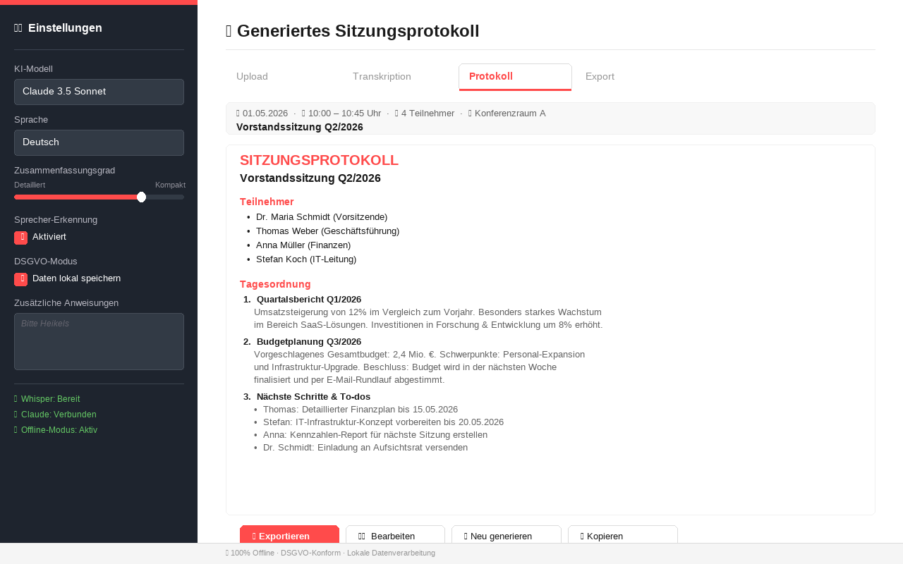
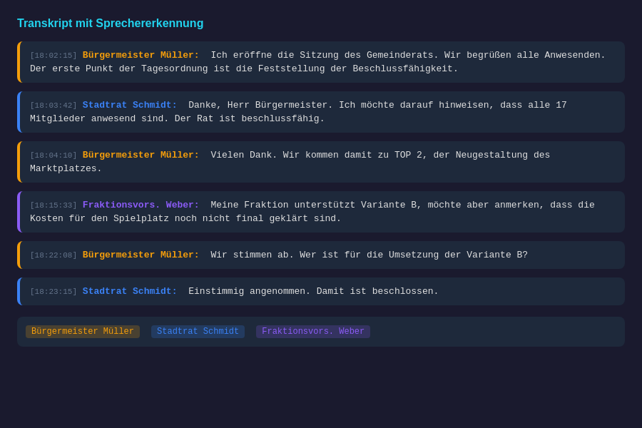
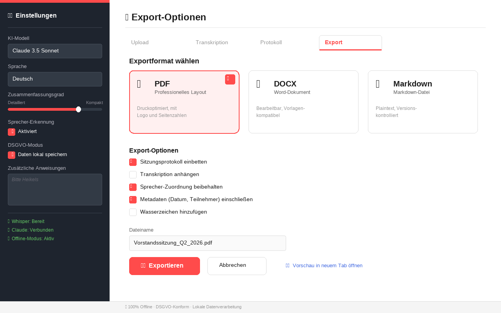

# Sitzungsprotokoll Ki

<p align="center">
</p>

    

> KI-gestützte Erstellung von Sitzungsprotokollen aus Transkriptionen

## Overview

Automatisiert die Erstellung professioneller Sitzungsprotokolle. Nutzt Whisper für Transkription und Claude/KI für Protokoll-Generierung. 100% offline-fähig, DSGVO-konform.

## Features

- Whisper-Transkription
- Sprecher-Erkennung
- KI-gestützte Protokoll-Generierung
- Export als PDF, DOCX, Markdown
- 100% offline-fähig
- Streamlit Web-Interface

## Tech Stack

| Tech | Zweck |
|------|-------|
| Python 3.10+ | Backend |
| Streamlit | Web-Interface |
| Whisper | Transkription |
| Claude AI | Protokoll-Generierung |
| Docker | Deployment |

## Quick Start

```bash
pip install -r requirements.txt
streamlit run app.py
```

## Screenshots

**Web-Interface**



**Generiertes Sitzungsprotokoll**



**Sprecher-Erkennung**



**Export-Optionen**



---

## Contributing

Beiträge sind willkommen! Bitte erstelle einen Issue oder Pull Request.

## License

MIT License — siehe [LICENSE](LICENSE).

<p align="center">
</p>